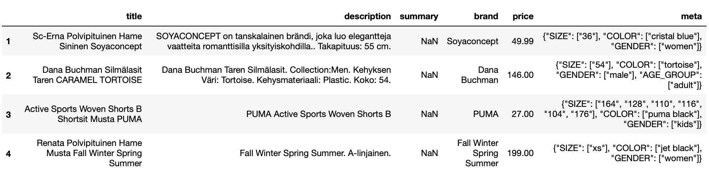
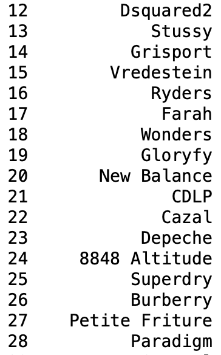
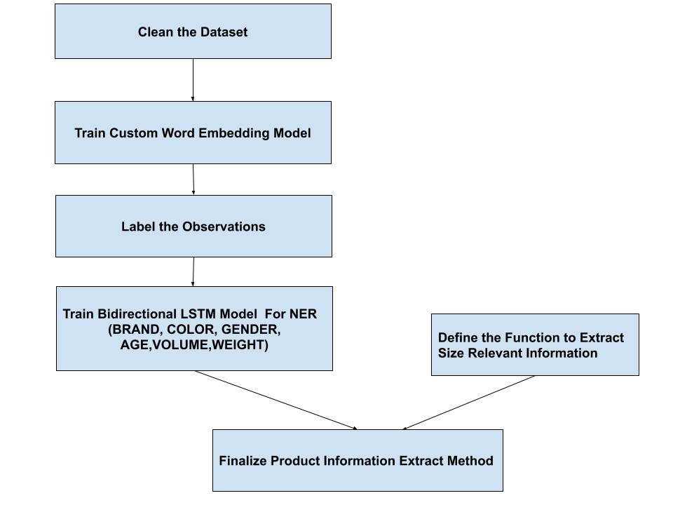
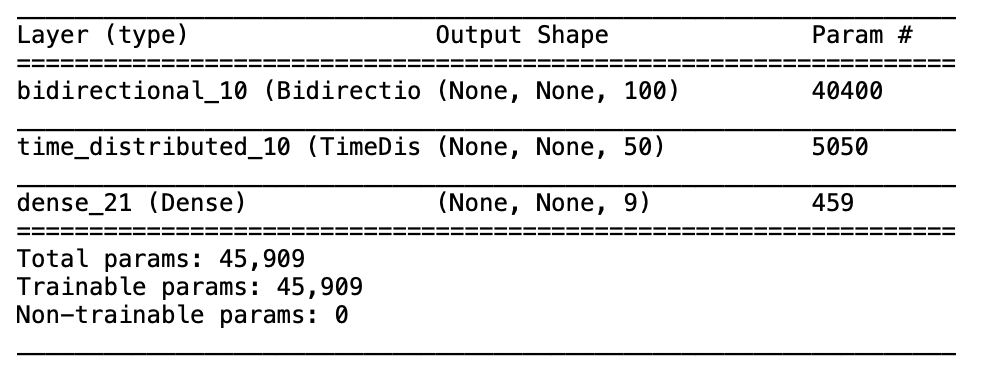

# NER & Extraction from product-data
The **goal** of this task is to extract product information such as **BRAND NAME, SIZE, COLOR, GENDER,AGE,VOLUME, WEIGHT** from product's titles and descriptions supplied by 119 unique providers. There are 670k observations in the dataset. There is no missing data in brand column, so it can be used to annotate Brand Name ([branding.py](https://github.com/YuTian8328/NER-Finnish-English-Product/blob/main/branding.py))  Meta column is also quite useful for labeling the data(size,color,gender and age) despite missing some information.([datagenerator.py](https://github.com/YuTian8328/NER-Finnish-English-Product/blob/main/datagenerator.py))

This is how it looks like

## Brand Names

Lots of brand names are rarely-used words or industry-created new words, thus existing word embedding methods, such as GloVe or Bert, can't properly embedding them. If these words can't be embedded properly in a NER model, it's definitely a big problem.

The solution is to train a custom word embedding model by using library **gensim** and library **nltk** with this special corpus. Based on this custom word embedding model, the NER Model can extract Brand Names quite effectively (Test set accuracy approximates 99.5%)([train_model.py](https://github.com/YuTian8328/NER-Finnish-English-Product/blob/main/train_model.py))

## COLOR, VOLUME, WEIGHT, GENDER, AGE
Color,volume,weight,gender and age are labled by using regex and information from meta column.

The NER Model has also achieved quite good performance in extracting color,volume and weight as well as brand name.
Test set accuracy is 99.65%.([train_model.py](https://github.com/YuTian8328/NER-Finnish-English-Product/blob/main/train_model.py))

## SIZE relevant information
The forms of size relevant information varied: 
- "100cm"
- "3.0cm - 5.0cm"
- "95x220cm"
- "0,5 x 1,8 x 49cm"
- "kokoja: s, m, l, xl, xxl"
- "kokoja: us 34 us 35 us 36"
- "etupituus: 56cm, takapituus: 70cm"
- "R14"
- "kokoja: 3, 3 1/2, 4, 4 1/2"
- "kokoja: yksi koko"
- "koko: standard"
- ......

To extract this kind of information, NER is not a good choice (accuracy approximates 50% in our experiment). But utilizing Regex is a quite effective and efficient solution. Thus the final information extraction strategy will be a combination of regex and NER model.([test_example.py](https://github.com/YuTian8328/NER-Finnish-English-Product/blob/main/test_example.py))

## Work FLow

## NER model
A BiLSTM neural network is built to execute NER and Extraction.

The architecture looks like this:

## Test With Unseen Text
([test_example.py](https://github.com/YuTian8328/NER-Finnish-English-Product/blob/main/test_example.py))

